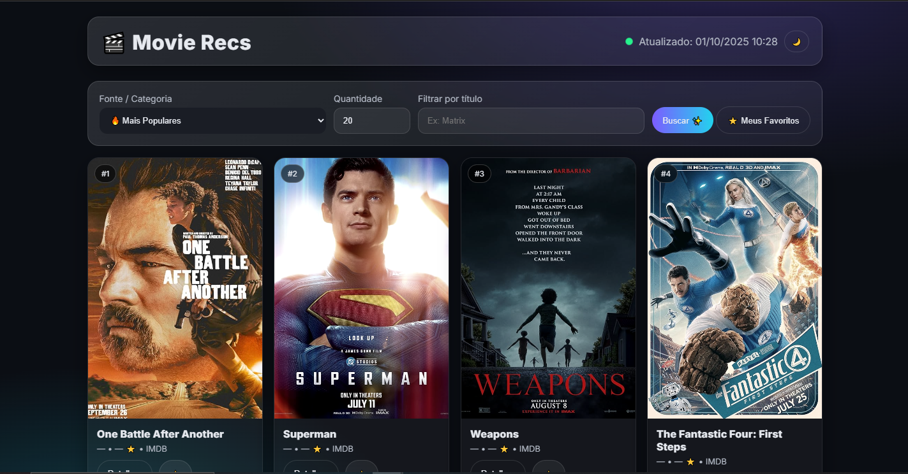

# 🎬 Movie Recommender Flask

Uma aplicação web em **Flask** que recomenda filmes em tempo real, combinando dados do **IMDb** e **TMDb**.  
Os resultados são atualizados diariamente, trazendo listas como *Mais Populares*, *Top 250* e *Em Cartaz*.  
Interface moderna com **CSS animations, blur e glassmorphism**.  

---

## ✨ Funcionalidades
- 🔥 **Categorias dinâmicas**: IMDb + TMDb  
- 🎞️ **Cartazes em alta qualidade**  
- 📝 **Sinopse exibida no hover (ou modal no futuro)**  
- ⚡ **Atualização automática a cada 24h**  
- 🎨 **UI moderna** (Glassmorphism, gradientes, animações)  
- 🖤 Desenvolvido por **Arthur Monteiro**  

---

## 🚀 Tecnologias
- [Python 3.11+](https://www.python.org/)
- [Flask](https://flask.palletsprojects.com/)
- [Requests](https://requests.readthedocs.io/)
- [Requests-Cache](https://requests-cache.readthedocs.io/)
- [BeautifulSoup4](https://www.crummy.com/software/BeautifulSoup/)
- [TMDb API](https://developers.themoviedb.org/3)

---

## 📂 Estrutura do projeto
```
movie-recommender-flask/
│── app.py
│── requirements.txt
│── scraping/
│ ├── imdb.py
│ └── tmdb.py
│── templates/
│ ├── base.html
│ └── index.html
│── static/
│ ├── styles.css
│ ├── scripts.js
│ └── favicon.svg
└── .gitignore
```

---

## ⚙️ Instalação

### 1. Clone o repositório
```bash
git clone https://github.com/SEU-USUARIO/movie-recommender-flask.git
cd movie-recommender-flask
```

### 2. Crie um ambiente virtual (recomendado)
```bash
python -m venv venv
source venv/bin/activate   # Linux/Mac
venv\Scripts\activate      # Windows
```

### 3. Instale as dependências
```bash
pip install -r requirements.txt
```

### 4. Configure sua API key do TMDb  
Crie um arquivo `.env` na raiz e adicione:
```ini
TMDB_API_KEY=SUACHAVEAQUI
```
Sem a chave do TMDb, o app funciona apenas com dados do IMDb.

### 5. Rode a aplicação
```bash
python app.py
```
Abra no navegador: [http://127.0.0.1:5000](http://127.0.0.1:5000)

---

## 🖼️ Screenshots


---

## 🛡️ Licença
Este projeto é de uso livre para fins educativos e pessoais.  
IMDb e TMDb são marcas registradas — este projeto é apenas uma integração.

---

## 👨‍💻 Autor
**Arthur Monteiro**  
